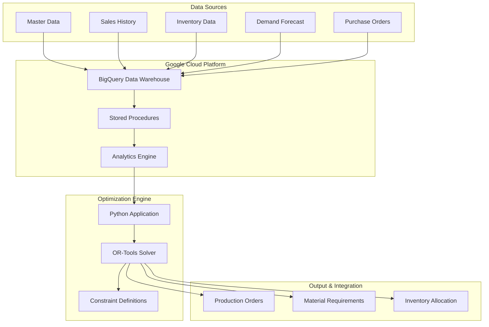
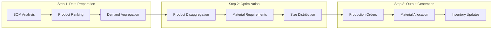
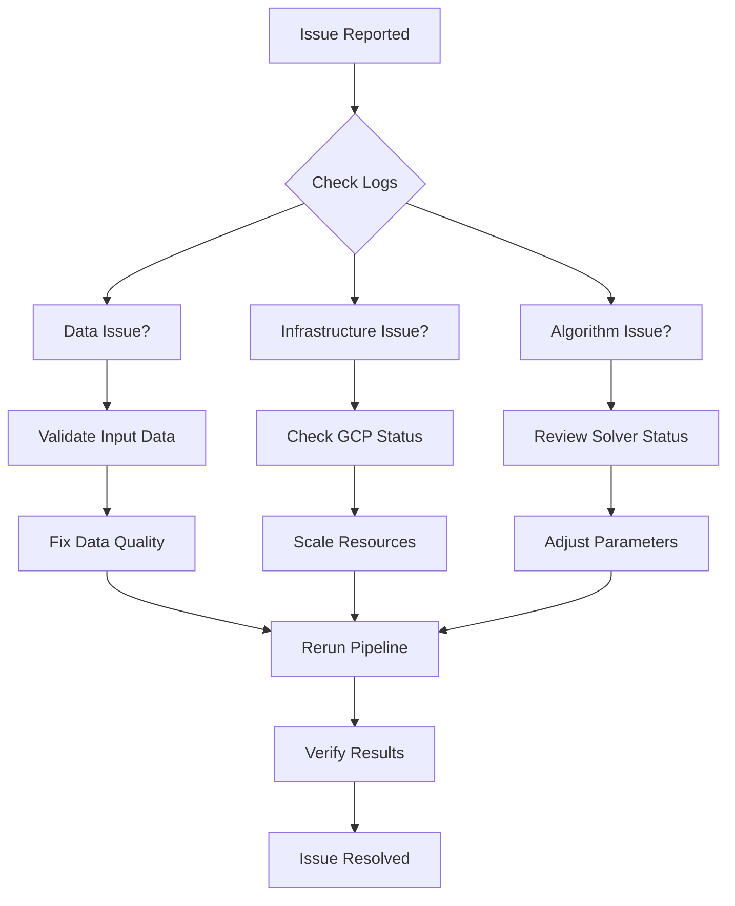

# Jewelry Material Planning System (MRP)

## Technical Specification & Documentation

**Version:** 1.0  
**Last Updated:** January 2025  
**System Type:** Material Resource Planning & Optimization  
**Domain:** Jewelry Manufacturing & Inventory Management  

---

## Table of Contents

1. [Executive Summary](#executive-summary)
2. [Business Context & Problem Statement](#business-context--problem-statement)
3. [System Architecture](#system-architecture)
4. [Data Processing Pipeline](#data-processing-pipeline)
5. [Optimization Algorithms](#optimization-algorithms)
6. [BigQuery Integration](#bigquery-integration)
7. [API Reference](#api-reference)
8. [Deployment & Configuration](#deployment--configuration)
9. [Troubleshooting & Maintenance](#troubleshooting--maintenance)
10. [Debugging Guide](#debugging-guide)
11. [Appendices](#appendices)

---

## Executive Summary

The Jewelry Material Planning System is a sophisticated Material Resource Planning (MRP) solution designed specifically for jewelry manufacturing operations. The system optimizes stone inventory allocation and production planning using mathematical optimization algorithms powered by Google OR-Tools.

### Key Capabilities

- **Multi-stage Optimization Pipeline**: 3-step process for product disaggregation, material requirement calculation, and size distribution optimization
- **Inventory Constraint Management**: Real-time stock availability analysis across multiple warehouse locations
- **Demand Forecasting Integration**: Incorporates sales history and forecast data for informed planning decisions
- **Jewelry Domain Expertise**: Specialized handling of diamonds, colored stones, pearls, and quality grading systems
- **Cloud-Native Architecture**: Built on Google Cloud Platform with BigQuery for data processing and containerized deployment

### Business Impact

The system maximizes material utilization efficiency while ensuring production demands are met within inventory constraints. It processes complex jewelry Bill of Materials (BOM) with precise tolerance requirements for stone sizes and quality grades.

### Technology Stack

- **Optimization Engine**: Google OR-Tools (Mixed Integer Programming & Constraint Programming)
- **Data Platform**: Google BigQuery for data warehousing and analytics
- **Runtime**: Python 3.11 with pandas for data manipulation
- **Deployment**: Docker containers on Google Cloud Platform
- **Integration**: REST APIs and stored procedures for data access

---

## Business Context & Problem Statement

### Industry Background

Jewelry manufacturing presents unique inventory management challenges:

1. **High-Value Materials**: Precious stones and metals require precise allocation
2. **Quality Specifications**: Diamonds and gemstones have strict grading requirements (VS1, A-grade)
3. **Size Tolerances**: Stone sizes must match product specifications within defined tolerances
4. **Demand Variability**: Seasonal and fashion trends affect product demand patterns
5. **Multi-Location Inventory**: Stock distributed across retail locations, warehouses, and transit

### Problem Statement

The challenge is to optimize production planning for jewelry products while:

- **Maximizing stone utilization** from available inventory
- **Meeting customer demand** within specified timeframes  
- **Respecting quality constraints** for diamonds and colored stones
- **Minimizing inventory holding costs** while avoiding stockouts
- **Coordinating multi-location inventory** across the supply chain

### Business Objectives

1. **Inventory Optimization**: Reduce excess stock while maintaining service levels
2. **Production Efficiency**: Optimize material allocation for maximum throughput
3. **Quality Assurance**: Ensure product specifications are met consistently
4. **Cost Reduction**: Minimize material waste and carrying costs
5. **Demand Fulfillment**: Meet customer orders with optimal resource allocation

---

## System Architecture

### High-Level Architecture



### Component Overview

| Component | Technology | Purpose |
|-----------|------------|---------|
| **Data Warehouse** | Google BigQuery | Centralized data storage and analytics |
| **Optimization Engine** | Python + OR-Tools | Mathematical optimization algorithms |
| **Business Logic** | SQL Stored Procedures | Jewelry domain rules and calculations |
| **Integration Layer** | Python GCP Client | Data access and API integration |
| **Deployment** | Docker + GCP | Containerized cloud deployment |

### Data Flow Architecture



---

## Data Processing Pipeline

The system implements a sophisticated 3-stage data processing pipeline that transforms raw business data into optimized production plans.

### Stage 1: Data Preparation & BOM Analysis

**Stored Procedure**: [`PROD_STEP_1_PB_PRODUCT_QUERY`](BigQuery%20routines/PROD_STEP_1_PB_PRODUCT_QUERY.SQL)

This stage processes jewelry Bill of Materials (BOM) data and performs complex product ranking:

#### Key Functions:
1. **BOM Validation**: Filters valid jewelry products and components
2. **Tolerance Checking**: Validates stone size tolerances against specifications
3. **Product Ranking**: Ranks alternative products based on sales history and availability
4. **Demand Aggregation**: Consolidates demand requirements by product family

#### Business Rules Applied:
- **Product Categories**: Diamond jewelry, colored stone jewelry, pearl jewelry, shell jewelry
- **Component Types**: Manufacturing diamonds (ZT02), loose diamonds, colored stones, pearls
- **Quality Filters**: Excludes sample products, includes only production-ready items
- **Status Validation**: Processes items with status '08' (active) and 'I1' (inactive but valid)

#### Output Table: `STEP_1_PB_PRODUCT_QUERY`

| Column | Description | Data Type |
|--------|-------------|-----------|
| `BASIC_NEW_2` | Product family identifier | STRING |
| `PFSAP` | Product structure code | STRING |
| `D0` | Demand quantity | INTEGER |
| `PRODUCT_CODE_LEFT_13` | Product code (13 characters) | STRING |
| `COMP_MAT_CODE` | Component material code | STRING |
| `COMPONENT_QTY` | Required component quantity | NUMERIC |
| `STOCK_AVAILABLE` | Available inventory | INTEGER |

### Stage 2: Python Optimization Processing

The Python application ([`main.py`](main.py)) processes the prepared data through three optimization steps:

#### Step 1: Product Disaggregation (Lines 13-94)
- **Objective**: Maximize stone usage and product output
- **Constraints**: Demand limits and inventory availability  
- **Algorithm**: Mixed Integer Programming (MIP)
- **Solver**: OR-Tools SCIP solver

#### Step 2: Material Requirement Calculation (Lines 95-120)
- **Purpose**: Calculate remaining stock and unfulfilled demand
- **Process**: Aggregate results and compute material gaps
- **Output**: Material shortage analysis

#### Step 3: Size Distribution Optimization
**Stored Procedure**: [`PROD_STEP_3_PHAN_RA_NI_QUERY_N`](BigQuery%20routines/PROD_STEP_3_PHAN_RA_NI_QUERY_N)

This stage optimizes size distribution across jewelry frameworks:

#### Key Analytics:
1. **Sales Trend Analysis**: 6-month historical sales data
2. **Inventory Position**: Multi-location stock aggregation
3. **Target Calculation**: Sales-based distribution targets
4. **Framework Optimization**: Size-specific allocation (NI framework)

#### Inventory Sources:
- **On-Hand Inventory**: Current warehouse stock
- **Transit Stock**: Items in transfer between locations
- **Incoming Orders**: Purchase orders and requisitions
- **TTBH Warehouse**: Specialized jewelry warehouse inventory

---

## Optimization Algorithms

### Mathematical Model Overview

The system uses a combination of optimization techniques to solve the jewelry material planning problem:

1. **Mixed Integer Programming (MIP)** for product disaggregation
2. **Linear Programming (LP)** for material allocation  
3. **Constraint Programming (CP)** for size distribution

### Step 1: Product Disaggregation Algorithm

**File**: [`main.py`](main.py) (Lines 27-55)

#### Decision Variables
```python
variables_product_demand[product] = solver.IntVar(0.0, infinity, f'product_{product}')
```

#### Objective Function
```
Maximize: Σ(product_demand * component_qty) + Σ(product_demand)
```

#### Constraints

1. **Demand Constraints**: Product allocation cannot exceed demand
```python
solver.Add(sum(variables_product_demand[product] 
           for product in products) <= demand)
```

2. **Inventory Constraints**: Component usage cannot exceed available stock
```python
solver.Add(sum(product_demand * component_qty) <= stock_available)
```

#### Solver Configuration
- **Engine**: SCIP (Solving Constraint Integer Programs)
- **Gap Tolerance**: 0.1% (0.001)
- **Variable Type**: Integer variables for product quantities

### Step 3: Size Distribution Algorithm

**File**: [`main.py`](main.py) (Lines 126-181)

#### Decision Variables
```python
variables_pb_ni[product_size] = solver.IntVar(0.0, infinity, f'khungni_{product_size}')
variables_z[product_size] = solver.NumVar(0.0, infinity, f'z_{product_size}')
variables_z1[product_size] = solver.NumVar(0.0, infinity, f'z_{product_size}')
```

#### Objective Function
```
Minimize: Σ(z + z + z1 * target_ratio)
```

Where:
- `z` represents deviation from inventory position targets
- `z1` represents deviation from sales velocity targets
- `target_ratio` weights the importance of sales targets

#### Constraints

1. **Allocation Balance**: Total size allocation equals product quantity
```python
solver.Add(sum(size_variables) <= pb_product)
solver.Add(sum(size_variables) >= pb_product)
```

2. **Target Deviation Tracking**: Absolute deviation constraints
```python
solver.Add(((allocated + inventory) / position) - target <= z)
solver.Add(target - ((allocated + inventory) / position) <= z)
```

3. **Sales Velocity Constraints**: Maintain 3-month sales targets
```python
solver.Add(((allocated + inventory) / avg_sales) - 3 <= z1)
solver.Add(3 - ((allocated + inventory) / avg_sales) <= z1)
```

### Algorithm Performance

- **Typical Runtime**: 30-60 seconds for full optimization
- **Problem Scale**: 1000+ products, 500+ materials, 50+ size categories
- **Optimization Gap**: Achieves <0.1% optimality gap
- **Memory Usage**: Efficient handling of large constraint matrices

---

## BigQuery Integration

### Data Architecture

The system leverages Google BigQuery as the primary data warehouse, integrating multiple data sources for comprehensive jewelry inventory analysis.

### Stored Procedures

#### 1. PROD_STEP_1_PB_PRODUCT_QUERY

**Purpose**: Prepares BOM data and performs product ranking for optimization

**Key Data Sources**:
- `W_MP_BOM_D`: Bill of Materials definitions
- `W_MASTERDATA_D`: Product master data
- `W_SALE_F`: Sales transaction history
- `STOCK_AVAILABLE_TEST`: Current inventory positions
- `D0_TEST`: Demand forecast data

**Complex Logic**:
- **Tolerance Validation**: Compares actual vs. required stone sizes
- **Product Ranking**: Multi-criteria ranking based on sales, availability, and material composition
- **Quality Filtering**: Applies jewelry-specific quality rules (VS1, A-grade diamonds)

#### 2. PROD_STEP_3_PHAN_RA_NI_QUERY_N

**Purpose**: Aggregates inventory positions and sales analytics for size optimization

**Analytical Components**:
- **Sales Trends**: 6-month rolling sales analysis
- **Inventory Aggregation**: Multi-location stock consolidation
- **Target Calculations**: Sales-based distribution ratios
- **Framework Analysis**: Size-specific jewelry framework evaluation

### Data Models

#### Input Tables

| Table | Description | Key Columns |
|-------|-------------|-------------|
| `W_MP_BOM_D` | Bill of Materials | `PRODUCT_CODE`, `COMP_MAT_CODE`, `COMPONENT_QTY` |
| `W_MASTERDATA_D` | Product Master Data | `MATERIAL`, `BASIC_NEW_2`, `PFSAP`, `X_PLANT_MATL_STATUS` |
| `W_SALE_F` | Sales Transactions | `MATERIAL`, `INVOICE_DATE`, `INVOICED_QTY` |
| `STOCK_AVAILABLE_TEST` | Inventory Data | `MATERIAL`, `INVENTORY` |
| `D0_TEST` | Demand Forecast | `BASIC_NEW_2`, `SL` (quantity) |

#### Output Tables

| Table | Description | Purpose |
|-------|-------------|---------|
| `STEP_1_PB_PRODUCT_QUERY` | Prepared BOM Data | Input for Python optimization |
| `STEP_1_PB_PRODUCT_OUTPUT` | Disaggregation Results | Product allocation results |
| `STEP_2_MUAMOI_NVL_OUTPUT` | Material Requirements | Material shortage analysis |
| `STEP_3_PHAN_RA_NI_QUERY_N` | Sales Analytics | Input for size optimization |
| `STEP_3_PHAN_RA_NI_OUTPUT_N` | Size Distribution | Final production orders |

### Integration Patterns

#### Connection Management
```python
# File: src/platform/gcp_client.py
os.environ["GOOGLE_APPLICATION_CREDENTIALS"] = "SA/service_account.json"
client = bigquery.Client()
```

#### Query Execution
```python
def query_gcp(query):
    client = bigquery.Client()
    query_job = client.query(query)
    query_job.result()
    return query_job
```

#### Data Upload
```python
def upload_table(df, target_table_name):
    job_config = bigquery.LoadJobConfig(
        write_disposition=bigquery.WriteDisposition.WRITE_TRUNCATE,
    )
    job = client.load_table_from_dataframe(df, target_table_name, job_config=job_config)
```

### Performance Optimization

- **Partitioning**: Tables partitioned by date for efficient querying
- **Clustering**: Clustered on key business dimensions (BASIC_NEW_2, PFSAP)
- **Materialized Views**: Pre-computed aggregations for complex calculations
- **Query Optimization**: Optimized JOIN strategies and predicate pushdown

---

## API Reference

### Core Functions

#### GCP Client Module (`src/platform/gcp_client.py`)

##### `query_gcp(query: str) -> bigquery.QueryJob`

Executes a BigQuery SQL query and returns the job object.

**Parameters:**
- `query`: SQL query string to execute

**Returns:**
- BigQuery QueryJob object with results

**Example:**
```python
df = query_gcp("SELECT * FROM `project.dataset.table`").to_dataframe()
```

##### `call_procedure(query: str) -> int`

Executes a BigQuery stored procedure.

**Parameters:**
- `query`: Procedure call statement

**Returns:**
- 1 for success, 0 for failure

**Example:**
```python
result = call_procedure('CALL `project.dataset.procedure`()')
```

##### `upload_table(df: pandas.DataFrame, target_table_name: str) -> None`

Uploads a pandas DataFrame to BigQuery table (overwrites existing data).

**Parameters:**
- `df`: DataFrame to upload
- `target_table_name`: Target BigQuery table in format `project.dataset.table`

**Example:**
```python
upload_table(results_df, 'pnj-material-planing.TESTING_MRP.OUTPUT_TABLE')
```

##### `load_table_from_df(df: pandas.DataFrame, target_table_name: str) -> int`

Appends pandas DataFrame to existing BigQuery table.

**Parameters:**
- `df`: DataFrame to append
- `target_table_name`: Target BigQuery table

**Returns:**
- 1 for success

##### `export_bigquery_table_to_csv(project_id: str, dataset_id: str, table_id: str, bucket_name: str, destination_blob_name: str) -> None`

Exports BigQuery table to CSV file in Google Cloud Storage.

**Parameters:**
- `project_id`: GCP project ID
- `dataset_id`: BigQuery dataset ID
- `table_id`: BigQuery table ID
- `bucket_name`: GCS bucket name
- `destination_blob_name`: Output file name

### Main Application (`main.py`)

#### Optimization Pipeline

The main application executes a 3-step optimization pipeline:

**Step 1: Product Disaggregation**
- Calls BigQuery procedure to prepare BOM data
- Executes OR-Tools mixed integer programming
- Maximizes stone utilization while respecting constraints

**Step 2: Material Requirements**
- Calculates remaining stock after Step 1 allocation
- Computes material shortages and requirements
- Prepares data for size distribution optimization

**Step 3: Size Distribution**
- Calls BigQuery procedure for sales analytics
- Executes OR-Tools constraint programming
- Optimizes size allocation across jewelry frameworks

#### Error Handling

The application includes retry logic and graceful error handling:

```python
# Retry mechanism for BigQuery operations
a = 0
while a < 3:
    try:
        job = client.load_table_from_dataframe(df, target_table_name, job_config=job_config)
        job.result()
        break
    except:
        print(f'Fail: {a}')
        time.sleep(random.randint(5, 10))
        a += 1
```

### Data Types and Structures

#### Key Data Structures

```python
# Product demand variables (Step 1)
variables_product_demand = {}  # Dict[str, IntVar]

# Size allocation variables (Step 3)  
variables_pb_ni = {}          # Dict[str, IntVar]
variables_z = {}              # Dict[str, NumVar]
variables_z1 = {}             # Dict[str, NumVar]
```

#### Configuration Parameters

```python
# Solver configuration
gap = 0.001  # 0.1% optimality gap
solver_parameters = pywraplp.MPSolverParameters()
solver_parameters.SetDoubleParam(solver_parameters.RELATIVE_MIP_GAP, gap)
```

---

## Deployment & Configuration

### Docker Containerization

The application is containerized using Docker for consistent deployment across environments.

#### Dockerfile Configuration

```dockerfile
FROM python:3.11

# Create application directory structure
RUN mkdir /docker-application
RUN mkdir /docker-application/SA
RUN mkdir /docker-application/src
RUN mkdir /docker-application/src/platform

WORKDIR /docker-application

# Copy application files
COPY ./requirements.txt /docker-application/requirements.txt
COPY ./main.py /docker-application/main.py
COPY ./src /docker-application/src
COPY ./SA /docker-application/SA

# Set environment variables
ENV GOOGLE_APPLICATION_CREDENTIALS /docker-application/SA/service_account.json

# Install dependencies
RUN pip install update
RUN python -m pip install --upgrade pip
RUN pip install -r /docker-application/requirements.txt

# Run application
CMD ["python3","main.py"]
```

#### Key Dependencies

**Core Libraries** (from [`requirements.txt`](requirements.txt)):
- `ortools==9.7.2996` - Google OR-Tools optimization library
- `pandas==1.5.2` - Data manipulation and analysis
- `google-cloud-bigquery==3.4.1` - BigQuery client library
- `google-cloud-core==2.3.2` - Google Cloud core libraries
- `numpy==1.24.1` - Numerical computing

**Additional Components**:
- `APScheduler==3.10.0` - Job scheduling
- `docker` - Containerization platform
- `python-dateutil==2.8.2` - Date/time utilities

### Environment Configuration

#### Google Cloud Authentication

The application requires a service account for BigQuery access:

```bash
# Environment variable (set in Dockerfile)
GOOGLE_APPLICATION_CREDENTIALS=/docker-application/SA/service_account.json
```

#### Service Account Permissions

Required IAM roles for the service account:
- `BigQuery Data Editor` - Read/write access to datasets
- `BigQuery Job User` - Execute queries and jobs  
- `Storage Object Viewer` - Access to GCS buckets (if needed)

#### BigQuery Configuration

**Project**: `pnj-material-planing`
**Dataset**: `TESTING_MRP`

**Key Tables**:
- Input: `STEP_1_PB_PRODUCT_QUERY`, `STEP_3_PHAN_RA_NI_QUERY_N`
- Output: `STEP_1_PB_PRODUCT_OUTPUT`, `STEP_2_MUAMOI_NVL_OUTPUT`, `STEP_3_PHAN_RA_NI_OUTPUT_N`

### Deployment Process

#### 1. Build Docker Image

```bash
docker build -t jewelry-mrp:latest .
```

#### 2. Deploy to Google Cloud

```bash
# Tag for Google Container Registry
docker tag jewelry-mrp:latest gcr.io/pnj-material-planing/jewelry-mrp:latest

# Push to registry
docker push gcr.io/pnj-material-planing/jewelry-mrp:latest
```

#### 3. Cloud Run Deployment

```bash
gcloud run deploy jewelry-mrp \
    --image gcr.io/pnj-material-planing/jewelry-mrp:latest \
    --platform managed \
    --region asia-southeast1 \
    --memory 4Gi \
    --cpu 2 \
    --timeout 3600
```

### Configuration Management

#### Runtime Parameters

| Parameter | Default | Description |
|-----------|---------|-------------|
| `gap` | 0.001 | Solver optimality gap (0.1%) |
| `infinity` | solver.infinity() | Upper bound for variables |
| `timeout` | 3600s | Maximum execution time |

#### Monitoring Configuration

- **Execution Time Tracking**: Start/end timestamps logged
- **Step Progress**: Each optimization step logs completion
- **Error Handling**: Retry logic with exponential backoff
- **Resource Monitoring**: Memory and CPU usage tracking

### Performance Tuning

#### Solver Configuration

```python
# Mixed Integer Programming parameters
gap = 0.001
solver_parameters = pywraplp.MPSolverParameters()
solver_parameters.SetDoubleParam(solver_parameters.RELATIVE_MIP_GAP, gap)
```

#### Memory Optimization

- **Chunked Processing**: Large datasets processed in batches
- **Garbage Collection**: Explicit memory cleanup between steps
- **Variable Scope**: Limited variable lifetime to reduce memory usage

#### BigQuery Optimization

- **Query Optimization**: Efficient JOIN strategies and filtering
- **Result Caching**: Temporary tables for intermediate results
- **Parallel Processing**: Concurrent query execution where possible

---

## Troubleshooting & Maintenance

### Common Issues and Solutions

#### 1. BigQuery Connection Errors

**Symptoms**: 
- Authentication failures
- "Permission denied" errors
- Connection timeouts

**Solutions**:
```bash
# Verify service account credentials
gcloud auth activate-service-account --key-file=SA/service_account.json

# Check BigQuery permissions
gcloud projects get-iam-policy pnj-material-planing

# Test connection
bq ls pnj-material-planing:TESTING_MRP
```

#### 2. OR-Tools Solver Issues

**Symptoms**:
- Solver returns non-optimal status
- Memory errors during optimization
- Timeout errors

**Solutions**:
```python
# Check solver status
if status != pywraplp.Solver.OPTIMAL:
    print(f"Solver status: {status}")
    print(f"Optimal status code: {pywraplp.Solver.OPTIMAL}")

# Increase memory limits
solver_parameters.SetDoubleParam(solver_parameters.TIME_LIMIT, 7200)  # 2 hours

# Reduce problem size
# Filter input data to smaller subsets for testing
```

#### 3. Data Quality Issues

**Symptoms**:
- Missing or null values in key columns
- Inconsistent product codes
- Invalid inventory quantities

**Solutions**:
```sql
-- Data validation queries
SELECT COUNT(*) FROM STEP_1_PB_PRODUCT_QUERY WHERE COMPONENT_QTY IS NULL;
SELECT COUNT(*) FROM STEP_1_PB_PRODUCT_QUERY WHERE STOCK_AVAILABLE < 0;

-- Data cleansing
UPDATE table SET STOCK_AVAILABLE = 0 WHERE STOCK_AVAILABLE < 0;
```

#### 4. Performance Issues

**Symptoms**:
- Long execution times
- Memory exhaustion
- Timeout errors

**Solutions**:
- **Reduce Data Scope**: Filter to specific product families
- **Increase Resources**: Scale up Cloud Run instances
- **Optimize Queries**: Add indexes and partitioning
- **Batch Processing**: Split large optimizations into smaller chunks

### Monitoring and Alerting

#### Key Metrics to Monitor

1. **Execution Time**: Track runtime for each optimization step
2. **Memory Usage**: Monitor peak memory consumption
3. **Data Volume**: Track input data size and growth
4. **Solver Performance**: Monitor optimization gap and convergence
5. **Error Rates**: Track failure rates and retry attempts

#### Logging Strategy

```python
# Execution tracking
start_time = datetime.now()
print(f'Step 1 start: {start_time}')

# Progress logging
print(f'Product disaggregation completed: {total_product} products')
print(f'Stone usage: {total_material} units')

# Performance metrics
end_time = datetime.now()
print(f'Total duration: {end_time - start_time}')
```

#### Health Checks

```python
# Data validation
assert df.shape[0] > 0, "No input data found"
assert not df['COMPONENT_QTY'].isna().any(), "Missing component quantities"

# Solver validation  
assert status == pywraplp.Solver.OPTIMAL, f"Solver failed with status: {status}"

# Output validation
assert result.shape[0] > 0, "No optimization results generated"
```

### Maintenance Procedures

#### Regular Maintenance Tasks

1. **Data Refresh**: Update master data tables weekly
2. **Performance Review**: Monitor optimization performance monthly
3. **Capacity Planning**: Review resource utilization quarterly
4. **Backup Verification**: Validate data backups monthly
5. **Security Review**: Audit access permissions quarterly

#### Troubleshooting Workflow



#### Support Contacts

- **Technical Issues**: Data Engineering Team
- **Business Logic**: Business Analysts & Domain Experts  
- **Infrastructure**: DevOps & Cloud Operations
- **Emergency**: On-call support rotation

---

## Appendices

### Appendix A: Jewelry Domain Glossary

| Term | Definition |
|------|------------|
| **BASIC_NEW_2** | Product family identifier for jewelry items |
| **PFSAP** | Product structure classification code |
| **ZT02** | Component type code for manufacturing stones |
| **NI Framework** | Size classification system for jewelry pieces |
| **VS1** | Diamond clarity grade (Very Slightly Included 1) |
| **DMKN** | Product classification system |
| **TTBH** | Specialized jewelry warehouse location |
| **Khung NI** | Size framework for jewelry pieces |

### Appendix B: Mathematical Formulations

#### Product Disaggregation Model

**Objective Function:**
```
maximize Σᵢ Σⱼ (xᵢⱼ * cᵢⱼ) + Σᵢ xᵢ
```

Where:
- `xᵢⱼ` = quantity of component j used in product i
- `cᵢⱼ` = component quantity required per unit
- `xᵢ` = total production quantity of product i

**Constraints:**
```
Σᵢ xᵢ ≤ Dᵢ          ∀i (demand constraints)
Σᵢ (xᵢ * cᵢⱼ) ≤ Sⱼ   ∀j (inventory constraints)
xᵢ ≥ 0, integer      ∀i (non-negativity, integer)
```

#### Size Distribution Model

**Objective Function:**
```
minimize Σᵢ Σₖ (zᵢₖ + z'ᵢₖ + z''ᵢₖ * tᵢₖ)
```

Where:
- `zᵢₖ` = deviation from inventory position target
- `z'ᵢₖ` = deviation from sales velocity target  
- `z''ᵢₖ` = weighted deviation penalty
- `tᵢₖ` = target ratio for product i, size k

### Appendix C: Data Schema Reference

#### Table Schemas

**STEP_1_PB_PRODUCT_QUERY**
```sql
CREATE TABLE STEP_1_PB_PRODUCT_QUERY (
  BASIC_NEW_2 STRING,
  PFSAP STRING,
  PRODUCT_FAMILY STRING,
  BASIC_NEW_CODE STRING,
  D0 INTEGER,
  PRODUCT_CODE_LEFT_13 STRING,
  PRODUCT_NAME STRING,
  COMP_MAT_CODE STRING,
  COMP_MAT_NAME STRING,
  COMPONENT_QTY NUMERIC,
  STOCK_AVAILABLE INTEGER
);
```

**STEP_3_PHAN_RA_NI_QUERY_N**
```sql
CREATE TABLE STEP_3_PHAN_RA_NI_QUERY_N (
  BASIC_NEW_2 STRING,
  PFSAP STRING,
  PRODUCT_CODE_LEFT_13 STRING,
  KHUNG_NI_BASIC STRING,
  PB_PRODUCT INTEGER,
  INV_AVAILABLE INTEGER,
  ORG_SALES FLOAT64,
  AVG_SALES FLOAT64,
  TT_BASIC FLOAT64,
  INV_POSITION INTEGER
);
```

### Appendix D: Performance Benchmarks

#### Typical Performance Metrics

| Metric | Value | Notes |
|--------|-------|-------|
| **Total Runtime** | 45-90 seconds | Full 3-step pipeline |
| **Step 1 Optimization** | 15-30 seconds | Product disaggregation |
| **Step 3 Optimization** | 20-40 seconds | Size distribution |
| **Data Processing** | 10-20 seconds | BigQuery operations |
| **Memory Usage** | 2-4 GB | Peak memory consumption |
| **Input Data Volume** | 50K-100K rows | Typical input size |
| **Output Volume** | 10K-25K rows | Production orders |

#### Scalability Limits

- **Maximum Products**: ~10,000 unique products
- **Maximum Components**: ~5,000 materials  
- **Maximum Size Categories**: ~100 size frameworks
- **Maximum Constraints**: ~50,000 optimization constraints

---

**Document Version**: 1.0  
**Last Updated**: January 2025  
**Authors**: Technical Documentation Team  
**Review**: Business Analysis & Data Engineering Teams  

---

*This document serves as the comprehensive technical specification for the Jewelry Material Planning System. For questions or clarifications, please contact the development team.*