# Documentation Index & Navigation Guide

## Jewelry Material Planning System - Complete Documentation

Welcome to the comprehensive documentation for the Jewelry Material Planning System. This index provides organized access to all technical documentation, guides, and references.

---

## 📚 Documentation Structure

### 🏠 Main Documentation
- **[README.md](../README.md)** - Complete Technical Specification
  - Executive summary and system overview
  - Business context and problem statement  
  - System architecture and data flow
  - Mathematical optimization algorithms
  - BigQuery integration and data models
  - Deployment and operations guide

---

## 📖 Detailed Guides

### 🔧 Technical References

| Document | Description | Audience |
|----------|-------------|----------|
| **[API Reference](API_REFERENCE.md)** | Complete API documentation with code examples | Developers, Integrators |
| **[Deployment Guide](DEPLOYMENT_GUIDE.md)** | Step-by-step deployment instructions | DevOps, System Administrators |
| **[Configuration Templates](CONFIGURATION_TEMPLATES.md)** | Environment configs and optimization parameters | Developers, Operations |
| **[Debugging Guide](DEBUGGING_GUIDE.md)** | Constraint violation debugging and bug analysis | Developers, QA Engineers |

### 🎯 Quick Access Links

#### For Developers
- [Getting Started - Local Setup](DEPLOYMENT_GUIDE.md#local-development-setup)
- [API Functions Reference](API_REFERENCE.md#core-functions)
- [Code Examples](API_REFERENCE.md#usage-examples)
- [Error Handling Patterns](API_REFERENCE.md#error-handling)
- [Debugging Constraint Violations](DEBUGGING_GUIDE.md#debugging-methodology)

#### For DevOps Engineers  
- [Docker Deployment](DEPLOYMENT_GUIDE.md#docker-deployment)
- [Google Cloud Deployment](DEPLOYMENT_GUIDE.md#google-cloud-platform-deployment)
- [Environment Configuration](CONFIGURATION_TEMPLATES.md#environment-configuration)
- [Monitoring Setup](CONFIGURATION_TEMPLATES.md#monitoring--logging)

#### For Business Analysts
- [Business Context](../README.md#business-context--problem-statement)
- [Optimization Process](../README.md#optimization-algorithms)
- [Data Models](../README.md#data-processing-pipeline)
- [Jewelry Domain Logic](../README.md#business-context--problem-statement)

#### For System Administrators
- [Troubleshooting Guide](DEPLOYMENT_GUIDE.md#troubleshooting)
- [Performance Tuning](CONFIGURATION_TEMPLATES.md#performance-tuning)
- [Security Configuration](CONFIGURATION_TEMPLATES.md#security-configuration)
- [Health Monitoring](DEPLOYMENT_GUIDE.md#verification--testing)

---

## 🏗️ System Architecture Overview

```mermaid
flowchart TD
    A[📋 Main README] --> B[🔧 API Reference]
    A --> C[🚀 Deployment Guide]
    A --> D[⚙️ Configuration Templates]
    
    B --> E[GCP Client API]
    B --> F[Optimization Engine]
    B --> G[Code Examples]
    
    C --> H[Local Setup]
    C --> I[Docker Deployment]
    C --> J[Cloud Deployment]
    
    D --> K[Environment Configs]
    D --> L[Performance Tuning]
    D --> M[Security Settings]
    
    style A fill:#e1f5fe
    style B fill:#f3e5f5
    style C fill:#e8f5e8
    style D fill:#fff3e0
```



---

## 📂 File Organization

```
jewelry-material-planning/
├── README.md                          # Main technical specification
├── main.py                            # Core optimization application  
├── requirements.txt                   # Python dependencies
├── Dockerfile                         # Container configuration
├── debug.ipynb                        # Development notebook
├── docs/                              # Documentation directory
│   ├── INDEX.md                       # This navigation guide
│   ├── API_REFERENCE.md               # Complete API documentation
│   ├── DEPLOYMENT_GUIDE.md            # Deployment instructions
│   ├── CONFIGURATION_TEMPLATES.md     # Configuration examples
│   └── DEBUGGING_GUIDE.md             # Bug analysis and debugging
├── src/platform/                      # Source code
│   └── gcp_client.py                  # BigQuery client functions
├── BigQuery routines/                 # SQL stored procedures
│   ├── PROD_STEP_1_PB_PRODUCT_QUERY.SQL
│   └── PROD_STEP_3_PHAN_RA_NI_QUERY_N
└── SA/                                # Service account credentials
    └── service_account.json
```

---

## 🚀 Getting Started Workflows

### For New Developers

1. **📖 Start Here**: [README.md - Executive Summary](../README.md#executive-summary)
2. **🔍 Understand the Business**: [Business Context](../README.md#business-context--problem-statement)  
3. **🏗️ Learn the Architecture**: [System Architecture](../README.md#system-architecture)
4. **💻 Set Up Development**: [Local Development Setup](DEPLOYMENT_GUIDE.md#local-development-setup)
5. **🔧 Explore APIs**: [API Reference - Core Functions](API_REFERENCE.md#core-functions)
6. **📝 Review Examples**: [Usage Examples](API_REFERENCE.md#usage-examples)

### For Deployment Engineers

1. **📋 Requirements Check**: [Prerequisites](DEPLOYMENT_GUIDE.md#prerequisites)
2. **🐳 Container Setup**: [Docker Deployment](DEPLOYMENT_GUIDE.md#docker-deployment)
3. **☁️ Cloud Deployment**: [GCP Deployment](DEPLOYMENT_GUIDE.md#google-cloud-platform-deployment)
4. **⚙️ Configuration**: [Environment Configuration](CONFIGURATION_TEMPLATES.md#environment-configuration)
5. **✅ Testing**: [Verification & Testing](DEPLOYMENT_GUIDE.md#verification--testing)
6. **🔧 Troubleshooting**: [Common Issues](DEPLOYMENT_GUIDE.md#troubleshooting)

### For System Integrators

1. **🔌 API Overview**: [API Reference Guide](API_REFERENCE.md)
2. **🔄 Data Flow**: [Data Processing Pipeline](../README.md#data-processing-pipeline)
3. **📊 BigQuery Integration**: [BigQuery Integration](../README.md#bigquery-integration)
4. **⚡ Performance**: [Optimization Parameters](CONFIGURATION_TEMPLATES.md#optimization-parameters)
5. **🛡️ Security**: [Security Configuration](CONFIGURATION_TEMPLATES.md#security-configuration)

---

## 🔍 Documentation Search Guide

### By Topic

#### **Optimization & Algorithms**
- [Mathematical Model Overview](../README.md#optimization-algorithms)
- [Step 1: Product Disaggregation](../README.md#step-1-product-disaggregation-algorithm)
- [Step 3: Size Distribution](../README.md#step-3-size-distribution-algorithm) 
- [OR-Tools Configuration](API_REFERENCE.md#optimization-engine-api)
- [Solver Parameters](CONFIGURATION_TEMPLATES.md#optimization-parameters)

#### **Data & BigQuery**
- [Data Processing Pipeline](../README.md#data-processing-pipeline)
- [BigQuery Stored Procedures](../README.md#bigquery-integration)
- [Data Models & Schemas](../README.md#data-models)
- [BigQuery Configuration](CONFIGURATION_TEMPLATES.md#bigquery-configuration)
- [Data Structures](API_REFERENCE.md#data-structures)

#### **Deployment & Operations**
- [Docker Containerization](../README.md#docker-containerization)
- [Cloud Run Deployment](DEPLOYMENT_GUIDE.md#google-cloud-platform-deployment)
- [Environment Setup](DEPLOYMENT_GUIDE.md#local-development-setup)
- [Configuration Management](DEPLOYMENT_GUIDE.md#configuration-management)
- [Monitoring & Logging](CONFIGURATION_TEMPLATES.md#monitoring--logging)

#### **Development & Integration**
- [GCP Client Functions](API_REFERENCE.md#gcp-client-api)
- [Python API Reference](API_REFERENCE.md#core-functions)
- [Code Examples](API_REFERENCE.md#usage-examples)
- [Error Handling](API_REFERENCE.md#error-handling)
- [Testing Procedures](DEPLOYMENT_GUIDE.md#verification--testing)

#### **Bug Analysis & Debugging**
- [Constraint Violation Analysis](DEBUGGING_GUIDE.md#debugging-methodology)
- [Root Cause Analysis](DEBUGGING_GUIDE.md#common-root-causes)
- [Validation Queries](DEBUGGING_GUIDE.md#analysis-queries)
- [Debug Code Examples](DEBUGGING_GUIDE.md#immediate-fixes)

### By File Type

#### **Configuration Files**
- [Environment Variables](CONFIGURATION_TEMPLATES.md#environment-configuration)
- [Docker Configuration](CONFIGURATION_TEMPLATES.md#docker-configuration)
- [BigQuery Settings](CONFIGURATION_TEMPLATES.md#bigquery-configuration)
- [Security Config](CONFIGURATION_TEMPLATES.md#security-configuration)

#### **SQL Scripts**
- [Step 1 BOM Procedure](../BigQuery%20routines/PROD_STEP_1_PB_PRODUCT_QUERY.SQL)
- [Step 3 Analytics Procedure](../BigQuery%20routines/PROD_STEP_3_PHAN_RA_NI_QUERY_N)
- [Schema Definitions](CONFIGURATION_TEMPLATES.md#bigquery-configuration)

#### **Python Code**
- [Main Application](../main.py)
- [GCP Client Module](../src/platform/gcp_client.py)
- [Configuration Classes](CONFIGURATION_TEMPLATES.md#solver-configuration-templates)

---

## 🏷️ Document Tags & Categories

### By Complexity Level

| Level | Documents | Description |
|-------|-----------|-------------|
| **Beginner** | [README - Executive Summary](../README.md#executive-summary) | High-level overview |
| **Intermediate** | [Deployment Guide](DEPLOYMENT_GUIDE.md) | Practical implementation |
| **Advanced** | [API Reference](API_REFERENCE.md), [Configuration Templates](CONFIGURATION_TEMPLATES.md) | Detailed technical reference |

### By Role

| Role | Primary Documents | Secondary Documents |
|------|------------------|-------------------|
| **Business Analyst** | [README - Business Context](../README.md#business-context--problem-statement) | [Data Models](../README.md#data-processing-pipeline) |
| **Developer** | [API Reference](API_REFERENCE.md) | [Configuration Templates](CONFIGURATION_TEMPLATES.md) |
| **DevOps Engineer** | [Deployment Guide](DEPLOYMENT_GUIDE.md) | [Configuration Templates](CONFIGURATION_TEMPLATES.md) |
| **System Administrator** | [Troubleshooting](DEPLOYMENT_GUIDE.md#troubleshooting) | [Performance Tuning](CONFIGURATION_TEMPLATES.md#performance-tuning) |
| **QA Engineer** | [Debugging Guide](DEBUGGING_GUIDE.md) | [Testing Procedures](DEPLOYMENT_GUIDE.md#verification--testing) |

---

## 📊 Documentation Metrics

### Coverage Areas

- ✅ **System Architecture** - Complete
- ✅ **Business Logic** - Complete  
- ✅ **Technical Implementation** - Complete
- ✅ **Deployment Procedures** - Complete
- ✅ **Configuration Management** - Complete
- ✅ **API Documentation** - Complete
- ✅ **Troubleshooting** - Complete
- ✅ **Security Guidelines** - Complete

### Documentation Standards

- **Format**: Markdown with consistent styling
- **Code Examples**: Syntax-highlighted with explanations
- **Diagrams**: Mermaid charts for visual clarity
- **Cross-References**: Linked navigation between documents
- **Versioning**: Version numbers and update dates
- **Audience**: Multi-level documentation for different roles

---

## 🔄 Update & Maintenance

### Document Versioning

| Document | Current Version | Last Updated |
|----------|----------------|--------------|
| README.md | 1.0 | January 2025 |
| API_REFERENCE.md | 1.0 | January 2025 |
| DEPLOYMENT_GUIDE.md | 1.0 | January 2025 |
| CONFIGURATION_TEMPLATES.md | 1.0 | January 2025 |
| DEBUGGING_GUIDE.md | 1.0 | January 2025 |

### Maintenance Schedule

- **Monthly**: Review accuracy of deployment procedures
- **Quarterly**: Update configuration templates and examples
- **Bi-annually**: Comprehensive review of all documentation
- **As-needed**: Updates for new features or system changes

### Contributing to Documentation

1. **Review Existing Content**: Check current documentation for gaps
2. **Follow Style Guide**: Maintain consistent formatting and tone
3. **Update Cross-References**: Ensure all links remain valid
4. **Test Procedures**: Verify all code examples and instructions work
5. **Update Index**: Add new documents to this navigation guide

---

## 📞 Support & Contact

### Documentation Issues
- **Missing Information**: Create issue with specific gap identification
- **Incorrect Procedures**: Report steps that don't work as documented  
- **Unclear Instructions**: Highlight confusing sections for clarification
- **Broken Links**: Report any navigation or cross-reference issues

### Technical Support Escalation
1. **Level 1**: Check relevant documentation section
2. **Level 2**: Review troubleshooting guides
3. **Level 3**: Contact development team with specific error details
4. **Level 4**: Escalate to architecture team for design questions

---

**Navigation Index Version**: 1.0
**Last Updated**: January 2025
**Total Documentation Pages**: 5 main documents + 1 index
**Total Content**: ~2400+ lines of comprehensive technical documentation

---

*This index serves as the central navigation hub for all Jewelry Material Planning System documentation. Use the links and workflows above to efficiently find the information you need.*